# Insect-Host Plant Interactions: Citizen Science Data Analysis and Species Distribution Modeling

ENEZA Data Science Internship Project, International Centre of Insect Physiology and Ecology (icipe)

## Project Overview

Citizen science platforms such as iNaturalist provide large volumes of georeferenced, time stamped biodiversity observations, including insect host plant interaction data. This project uses iNaturalist occurrence and interaction records for fruit flies (Tephritidae), including Bactrocera, Zeugodacus, and Dacus species, to:

1. Clean and structure raw citizen science observation data
2. Analyze host plant interaction patterns (which pest species associate with which host plants)
3. Model species distribution and ecological suitability (SDM) using occurrence and environmental data, with a specific focus on transferability to regions with sparse observation records, particularly East Africa
4. Combine climate suitability with documented host plant associations into a practical, farmer facing risk lookup tool
5. Deploy an interactive dashboard for exploring the results

Supervisors: Subramanian Sevgan, Elfatih Abdel Rehman
Host Institution: International Centre of Insect Physiology and Ecology (icipe)

## Objectives

- [x] Data cleaning and quality assessment
- [x] Exploratory data analysis (species, temporal, and geographic patterns)
- [x] Host pest interaction analysis
- [x] Species Distribution Modeling (SDM)
- [x] Interactive dashboard deployment

## Data

This project uses iNaturalist observations of Tephritidae (fruit flies) and matched environmental covariates. Raw occurrence data and environmental raster layers are not included in this repository. See [`data/README.md`](data/README.md) for how the pipeline expects data to be structured if reproducing this work.

## Project Structure

```mermaid
flowchart TD
    A[Project Root] --> B[data]
    A --> C[notebooks]
    A --> D[src]
    A --> E[outputs]
    A --> F[docs]
    A --> G[requirements.txt]
    A --> H[README.md]

    C --> C1[01_eda.ipynb]
    C --> C2[02_modeling.ipynb]
    C --> C3[03_ensemble_modeling.ipynb]

    D --> D1[src/data]
    D --> D2[src/analysis]
    D --> D3[src/modeling]
    D --> D4[src/dashboard]

    E --> E1[outputs/figures]
    E --> E2[outputs/models]

    style A fill:#f3e5f5,stroke:#9575cd,stroke-width:1px,color:#000000
    style B fill:#f5f5f5,stroke:#bdbdbd,stroke-width:1px,color:#000000
    style C fill:#f5f5f5,stroke:#bdbdbd,stroke-width:1px,color:#000000
    style D fill:#f5f5f5,stroke:#bdbdbd,stroke-width:1px,color:#000000
    style E fill:#f5f5f5,stroke:#bdbdbd,stroke-width:1px,color:#000000
    style F fill:#f5f5f5,stroke:#bdbdbd,stroke-width:1px,color:#000000
    style G fill:#f5f5f5,stroke:#bdbdbd,stroke-width:1px,color:#000000
    style H fill:#f5f5f5,stroke:#bdbdbd,stroke-width:1px,color:#000000
    style C1 fill:#e8f5e9,stroke:#81c784,stroke-width:1px,color:#000000
    style C2 fill:#e3f2fd,stroke:#64b5f6,stroke-width:1px,color:#000000
    style C3 fill:#fff3e0,stroke:#ffb74d,stroke-width:1px,color:#000000
    style D1 fill:#fff8e1,stroke:#ffd54f,stroke-width:1px,color:#000000
    style D2 fill:#fff8e1,stroke:#ffd54f,stroke-width:1px,color:#000000
    style D3 fill:#fff8e1,stroke:#ffd54f,stroke-width:1px,color:#000000
    style D4 fill:#fff8e1,stroke:#ffd54f,stroke-width:1px,color:#000000
    style E1 fill:#fce4ec,stroke:#f06292,stroke-width:1px,color:#000000
    style E2 fill:#fce4ec,stroke:#f06292,stroke-width:1px,color:#000000
```



| Folder | Purpose |
| --- | --- |
| `data/` | Raw and cleaned data, and extracted occurrence covariates (not committed, see `data/README.md`) |
| `notebooks/` | Analysis notebooks, see Workflow below |
| `outputs/figures/` | Generated plots, including species distribution maps |
| `outputs/models/` | Trained models, performance summaries, host plant lookup table, and precomputed Africa prediction grids used by the dashboard |
| `src/dashboard/` | Streamlit dashboard application |
| `docs/` | Supporting documentation |

## Setup

```bash
git clone https://github.com/Simon-Kimanzi/Fruit_fly-Host-Interactions-SDM-.git
cd Fruit_fly-Host-Interactions-SDM-

conda create -n eneza-project python=3.11 -y
conda activate eneza-project
pip install -r requirements.txt
```

Environmental layers (WorldClim bioclimatic variables and elevation, SoilGrids clay and pH) must be obtained separately and placed in a local folder, then referenced by updating the `ENV_DIR` path near the top of `02_modeling.ipynb` and `03_ensemble_modeling.ipynb`.

## Workflow

1. `notebooks/01_eda.ipynb`: loads the raw iNaturalist export, explores it, cleans it, and exports `data/clean_data.csv`
2. `notebooks/02_modeling.ipynb`: loads the cleaned dataset and covers host pest interaction analysis, environmental covariate extraction, Species Distribution Modeling with target group background sampling and spatial block cross validation, Africa suitability mapping with an extrapolation honesty check, and the farmer facing risk lookup
3. `notebooks/03_ensemble_modeling.ipynb`: an independent second pipeline using VIF based covariate selection and a three classifier ensemble (Random Forest, Gradient Boosting, Logistic Regression), used to cross validate the findings from notebook 02
4. `src/dashboard/app.py`: an interactive Streamlit dashboard built on the outputs of the above

Run the dashboard locally with:

```bash
streamlit run src/dashboard/app.py
```

## Live Dashboard

[https://r8k8s8ec5hq25e5jal8mbd.streamlit.app/](https://r8k8s8ec5hq25e5jal8mbd.streamlit.app/)

## Methodology Notes

Background sampling for SDM was evaluated across three strategies before settling on a final approach: buffered background near presence points, discarded because it risks extrapolation into under sampled regions such as East Africa; global random background, discarded because it made presence versus background separation trivially easy and inflated apparent accuracy; and target group background (using other Tephritidae species as background, following Phillips et al., 2009), which was adopted as it best corrects for citizen science sampling bias.

Model validation used spatial block cross validation rather than random k fold cross validation, since random folds allow nearby points with near identical climate values to leak between training and test sets.

Any suitability prediction is accompanied by a species specific novelty check, quantifying what fraction of covariates fall outside that species' confirmed climatic range, so that predictions for under sampled regions are clearly flagged as hypotheses rather than validated forecasts.

Host plant location was deliberately not used as a spatial predictor of pest distribution, since host plant records in this dataset are recorded at the same coordinates as the pest sighting itself and cannot serve as independent evidence of where a host plant exists in the absence of the pest. The farmer facing tool instead relies on the farmer's own knowledge of what they grow. See the full project report for a detailed discussion of this limitation and recommended future work using independent host plant distribution data (for example MapSPAM or GBIF).

## Key Findings

- Host associations closely matched known literature, for example *Bactrocera oleae* associated almost exclusively with *Olea europaea* (olive) and *Bactrocera cucurbitae* with Cucurbitaceae.
- Five species were modeled with sufficient occurrence data: *Bactrocera dorsalis*, *Bactrocera oleae*, *Zeugodacus tau*, *Bactrocera cucurbitae*, and *Bactrocera tryoni*. Spatial cross validated AUC ranged from 0.71 (*B. cucurbitae*) to 0.99 (*B. oleae*), correlating with known ecological specialization.
- *Bactrocera oleae*'s predicted suitability map correctly restricts high suitability to Mediterranean climate zones and shows near zero suitability across sub-Saharan Africa, providing evidence the models learned genuine climate signal rather than incidental correlation.
- East African occurrence records are sparse to nonexistent in this dataset for the modeled species, reflecting lower regional citizen science participation rather than true absence.
- Findings were independently cross validated using a second pipeline (VIF based covariate selection plus a three classifier ensemble), which reproduced consistent AUC values and independently identified precipitation of the wettest month as a leading predictor.

## Author

Simon Kimanzi
