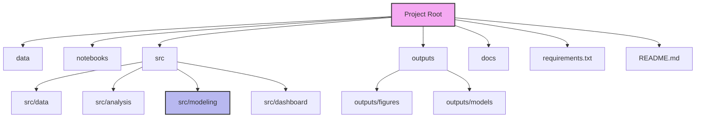

# Insect-Host Plant Interactions: Citizen Science Data Analysis and Species Distribution Modeling

ENEZA Data Science Internship Project, International Centre of Insect Physiology and Ecology (icipe)

## Project Overview

Citizen science platforms such as iNaturalist provide large volumes of georeferenced, time stamped biodiversity observations, including insect host plant interaction data. This project uses iNaturalist occurrence and interaction records for fruit flies (Tephritidae), including Bactrocera, Zeugodacus, and Dacus species, to:

1. Clean and structure raw citizen science observation data
2. Analyze host plant interaction patterns (which pest species associate with which host plants)
3. Model species distribution and ecological suitability (SDM) using occurrence and environmental data
4. Deploy an interactive dashboard for exploring the results

Supervisors: Subramanian Sevgan, Elfatih Abdel Rehman
Host Institution: International Centre of Insect Physiology and Ecology (icipe)

## Objectives

- [ ] Data cleaning and quality assessment
- [ ] Exploratory data analysis (species, temporal, and geographic patterns)
- [ ] Host pest interaction analysis
- [ ] Species Distribution Modeling (SDM)
- [ ] Interactive dashboard deployment

## Data

Source: [iNaturalist](https://www.inaturalist.org/) observations of Tephritidae (fruit flies), including:

- Occurrence only records: where and when a fly was observed
- Interaction study records: observations with an identified host plant

Raw data is not committed to this repository due to mixed per record licensing (CC BY NC, CC0, CC BY ND, and others; see the `license` column). See [`data/README.md`](data/README.md) for instructions on obtaining the dataset.

## Project Structure



| Folder | Purpose |
| --- | --- |
| `data/` | Raw and cleaned data (not committed, see `data/README.md`) |
| `notebooks/` | Exploratory and analysis notebooks |
| `src/data/` | Data cleaning scripts |
| `src/analysis/` | EDA and host interaction analysis |
| `src/modeling/` | SDM model training |
| `src/dashboard/` | Streamlit app |
| `outputs/figures/` | Generated plots |
| `outputs/models/` | Trained model artifacts |
| `docs/` | Additional documentation |

## Setup

```bash
git clone https://github.com/Simon-Kimanzi/Fruit_fly-Host-Interactions-SDM-.git
cd Fruit_fly-Host-Interactions-SDM-

python -m venv venv
source venv/bin/activate

pip install -r requirements.txt
```

## Workflow

1. `notebooks/01_eda.ipynb`: load the raw data, clean it, and run exploratory analysis
2. `notebooks/02_modeling.ipynb`: load the cleaned dataset and run host interaction analysis and SDM
3. `src/dashboard/app.py`: Streamlit dashboard built on the outputs of the above

Run the dashboard locally with:

```bash
streamlit run src/dashboard/app.py
```

## Live Dashboard

Link will be added once deployed.

## Key Findings

To be filled in as analysis progresses.

## References

See the full project proposal in [`docs/project_proposal.md`](docs/project_proposal.md).

## Author

Simon Kimanzi

## License

Code in this repository: MIT License (see `LICENSE`).
Underlying observation data is subject to individual iNaturalist record licenses; see `data/README.md`.
