# Insect-Host Plant Interactions: Citizen Science Data Analysis and Species Distribution Modeling

ENEZA Data Science Internship Project, International Centre of Insect Physiology and Ecology (icipe)

## Project Overview

Citizen science platforms such as iNaturalist provide large volumes of georeferenced, time stamped biodiversity observations, including insect host plant interaction data. This project uses iNaturalist occurrence and interaction records for fruit flies (Tephritidae), including Bactrocera, Zeugodacus, and Dacus species, to:

1. Clean and structure raw citizen science observation data
2. Analyze host plant interaction patterns (which pest species associate with which host plants)
3. Model species distribution and ecological suitability (SDM) using occurrence and environmental data, with a specific focus on transferability to regions with sparse observation records, particularly East Africa
4. Combine climate suitability with documented host plant associations into a practical, farmer facing risk lookup tool
5. Deploy an interactive dashboard for exploring the results

Supervisors: Subramanian Sevgan, Elfatih Abdel Rehman
Host Institution: International Centre of Insect Physiology and Ecology (icipe)

## Objectives

- [x] Data cleaning and quality assessment
- [x] Exploratory data analysis (species, temporal, and geographic patterns)
- [x] Host pest interaction analysis
- [x] Species Distribution Modeling (SDM)
- [ ] Interactive dashboard deployment

## Data

This project uses iNaturalist observations of Tephritidae (fruit flies) and matched environmental covariates. Raw occurrence data and environmental raster layers are not included in this repository. See [`data/README.md`](data/README.md) for how the pipeline expects data to be structured if reproducing this work.

## Project Structure

```mermaid
flowchart TD
    A[Project Root] --> B[data]
    A --> C[notebooks]
    A --> D[src]
    A --> E[outputs]
    A --> F[docs]
    A --> G[requirements.txt]
    A --> H[README.md]

    C --> C1[01_eda.ipynb]
    C --> C2[02_modeling.ipynb]

    D --> D1[src/data]
    D --> D2[src/analysis]
    D --> D3[src/modeling]
    D --> D4[src/dashboard]

    E --> E1[outputs/figures]
    E --> E2[outputs/models]

    style A fill:#f3e5f5,stroke:#9575cd,stroke-width:1px,color:#000000
    style B fill:#f5f5f5,stroke:#bdbdbd,stroke-width:1px,color:#000000
    style C fill:#f5f5f5,stroke:#bdbdbd,stroke-width:1px,color:#000000
    style D fill:#f5f5f5,stroke:#bdbdbd,stroke-width:1px,color:#000000
    style E fill:#f5f5f5,stroke:#bdbdbd,stroke-width:1px,color:#000000
    style F fill:#f5f5f5,stroke:#bdbdbd,stroke-width:1px,color:#000000
    style G fill:#f5f5f5,stroke:#bdbdbd,stroke-width:1px,color:#000000
    style H fill:#f5f5f5,stroke:#bdbdbd,stroke-width:1px,color:#000000
    style C1 fill:#e8f5e9,stroke:#81c784,stroke-width:1px,color:#000000
    style C2 fill:#e3f2fd,stroke:#64b5f6,stroke-width:1px,color:#000000
    style D1 fill:#fff8e1,stroke:#ffd54f,stroke-width:1px,color:#000000
    style D2 fill:#fff8e1,stroke:#ffd54f,stroke-width:1px,color:#000000
    style D3 fill:#fff8e1,stroke:#ffd54f,stroke-width:1px,color:#000000
    style D4 fill:#fff8e1,stroke:#ffd54f,stroke-width:1px,color:#000000
    style E1 fill:#fce4ec,stroke:#f06292,stroke-width:1px,color:#000000
    style E2 fill:#fce4ec,stroke:#f06292,stroke-width:1px,color:#000000
```



| Folder | Purpose |
| --- | --- |
| `data/` | Raw and cleaned data, and extracted occurrence covariates (not committed, see `data/README.md`) |
| `notebooks/` | Analysis notebooks, see Workflow below |
| `outputs/figures/` | Generated plots, including species distribution maps |
| `outputs/models/` | Trained SDM models, performance summary, and host plant lookup table |
| `docs/` | Supporting documentation |

## Setup

```bash
git clone https://github.com/Simon-Kimanzi/Fruit_fly-Host-Interactions-SDM-.git
cd Fruit_fly-Host-Interactions-SDM-

conda create -n eneza-project python=3.11 -y
conda activate eneza-project
pip install -r requirements.txt
```

Environmental layers (WorldClim bioclimatic variables and elevation, SoilGrids clay and pH) must be obtained separately and placed in a local folder, then referenced by updating the `ENV_DIR` path near the top of `02_modeling.ipynb`.

## Workflow

1. `notebooks/01_eda.ipynb`: loads the raw iNaturalist export, explores it, cleans it, and exports `data/clean_data.csv`
2. `notebooks/02_modeling.ipynb`: loads the cleaned dataset and covers:
   - Host pest interaction analysis, and a host plant lookup table per species
   - Environmental covariate extraction at each occurrence location
   - Species Distribution Modeling using target group background sampling and spatial block cross validation
   - Suitability mapping across Africa, with an explicit check for where predictions fall outside a species' confirmed climate range
   - A farmer facing risk lookup function combining climate suitability with documented host plant associations

## Methodology Notes

Two methodological choices are worth documenting explicitly, since both were arrived at after testing simpler alternatives that did not hold up:

**Background sampling for SDM**: presence only species distribution models require background (pseudo absence) points for comparison. Background points are drawn using the target group approach: occurrence records of other Tephritidae species in this dataset are used as background, rather than randomly sampled geographic points. This corrects for citizen science sampling bias, since the background then reflects the same observation effort and habitat access as the presence data, rather than an arbitrary geographic assumption.

**Model validation**: models are validated using spatial block cross validation rather than standard random k fold cross validation, since random folds allow nearby points sharing near identical climate values to appear in both training and test sets, inflating performance scores without the model learning to generalize to new areas.

**Extrapolation honesty check**: any suitability prediction for a region is accompanied by a check for what fraction of environmental covariates fall outside the range this specific species has been confirmed to tolerate. Predictions in regions with substantial novel conditions are flagged and should be treated as hypotheses rather than validated forecasts, which matters directly for this project's African predictions given the region's sparse citizen science coverage.

## Key Findings

- Host associations closely matched known literature, for example *Bactrocera oleae* associated almost exclusively with *Olea europaea* (olive) and *Bactrocera cucurbitae* with Cucurbitaceae.
- Five species were modeled with sufficient occurrence data: *Bactrocera dorsalis*, *Bactrocera oleae*, *Zeugodacus tau*, *Bactrocera cucurbitae*, and *Bactrocera tryoni*. Spatial cross validated AUC ranged from 0.71 (*B. cucurbitae*) to 0.99 (*B. oleae*), correlating with known ecological specialization: climate specialists scored highest, broad generalists scored lower but still usable.
- *Bactrocera oleae*'s predicted suitability map correctly restricts high suitability to Mediterranean climate zones and shows near zero suitability across sub-Saharan Africa, consistent with its known ecology and providing evidence the models learned genuine climate signal rather than incidental correlation.
- East African occurrence records are sparse to nonexistent in this dataset for the modeled species, reflecting lower regional citizen science participation rather than true absence. Established populations of some modeled species are documented in the pest management literature for East Africa.
- Novelty analysis (fraction of Africa outside each species' confirmed climate range) ranged from 30 percent to 83 percent across species, independently reproducing the expected specialist versus generalist pattern.

## Live Dashboard

[Live dashboard](https://r8k8s8ec5hq25e5jal8mbd.streamlit.app/)

## Author

Simon Kimanzi

## License

Code in this repository: MIT License (see `LICENSE`).
Underlying observation data is subject to individual iNaturalist record licenses.
